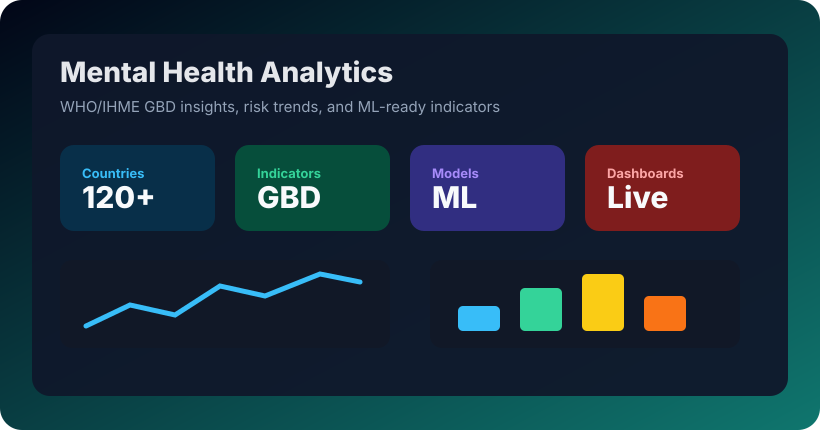
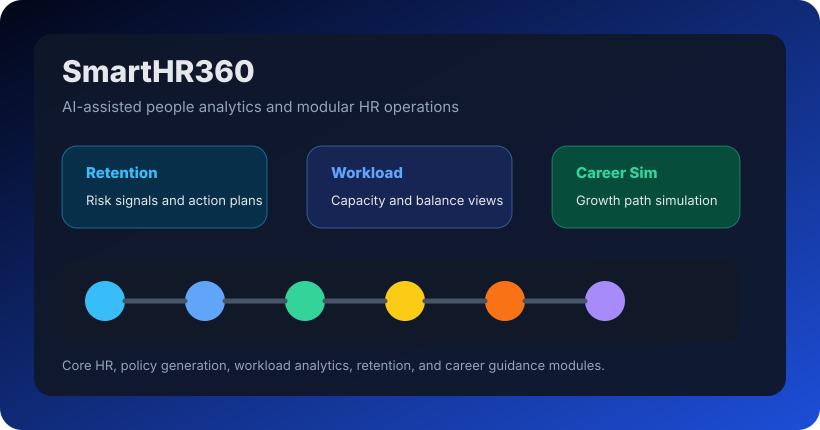
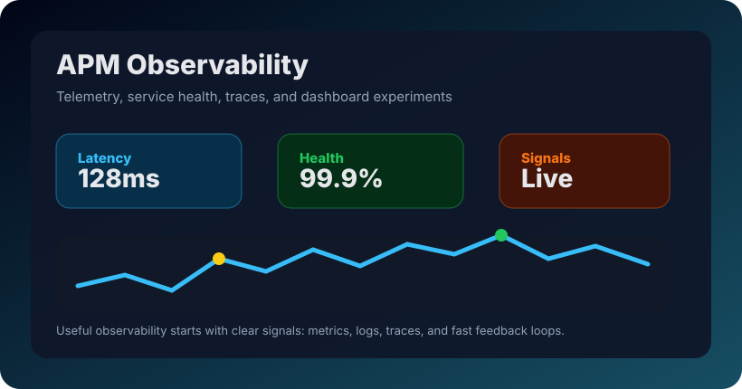
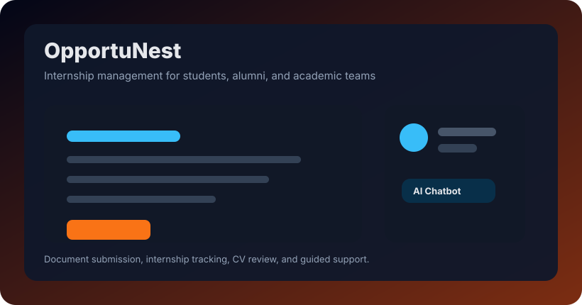
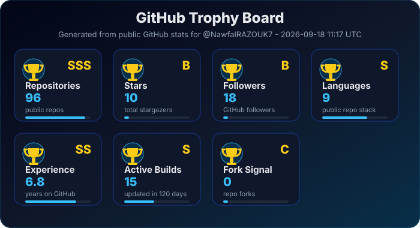
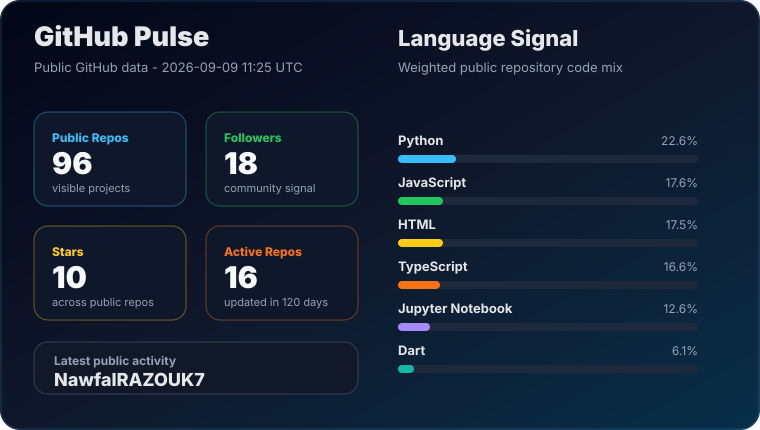
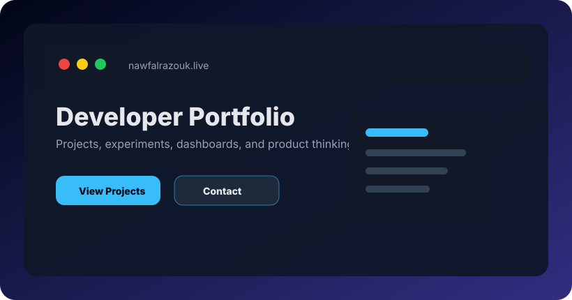

<h1>Hi, I'm Nawfal RAZOUK</h1>

  
  
  
  
  

  
  
  
  

<strong>Passion. Purpose. Progress.</strong>

---

## About Me

I am an IT engineer focused on software development, data-driven products, and AI-assisted platforms. I like building practical systems that connect clean interfaces, useful automation, and real-world analytics.

- Interested in **full-stack development**, **data engineering**, **automation**, and **human-centered digital tools**.
- I enjoy turning rough ideas into working prototypes, then refining them into useful products.

---

## Tech Stack

<h3>Stack by Role</h3>

  <strong>Frontend</strong> 
  

  <strong>Backend</strong> 
  

  <strong>Data and AI</strong> 
  

  <strong>DevOps and Tools</strong> 
  

<h3>Full Toolkit</h3>

  

---

## Featured Work

| Repository | Preview | Why it matters |
| --- | --- | --- |
|  |  | Public-health analytics using WHO/IHME GBD data, dashboards, advanced analysis, and ML-ready indicators. |
|  |  | HR analytics and modular people-operations tooling around retention, workload, career simulation, and policy generation. |
|  |  | Observability experiments for telemetry, monitoring, dashboards, and fast operational feedback loops. |
|  |  | Internship management for students and alumni with document submission, CV consultation, and chatbot support. |

---

## GitHub Trophies

The trophy board is generated locally from public GitHub data and refreshed by GitHub Actions, so it does not depend on the public trophy services that can fail with billing or rate-limit errors.

---

## GitHub Pulse

  

---

## Codewars

---

<h3>Let's Build Something Useful</h3>

I am always improving my craft through real projects, practical experiments, and consistent learning.

Open to internships, collaboration, and practical product work.

